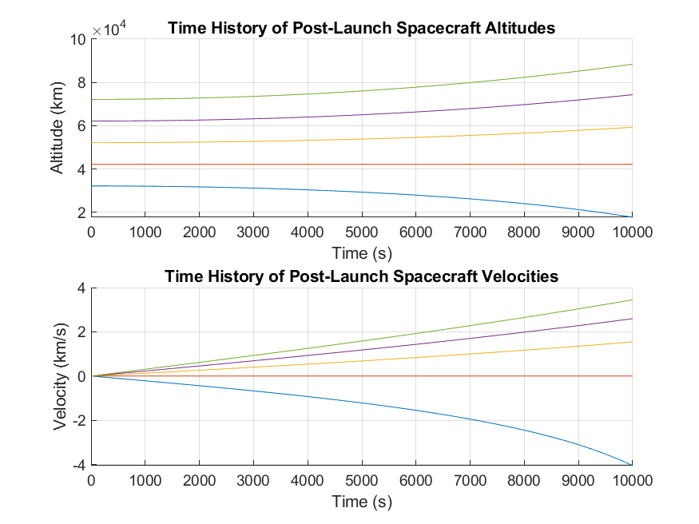

# 🚀 Space Elevator Launch Simulation
This project simulates the post-launch dynamics of a spacecraft launched from a space elevator. The script demonstrates the dynamics for various initial altitude offsets from geostationary orbit, imitating the launch from a simplified space elevator.

## Installation
To use this script, you will need MATLAB installed on your system. You can download and install MATLAB from the official website.

## Usage
1. Download the `space_elevator_launch_simulation.m` script and save it to your local MATLAB working directory.
2. Open MATLAB, and navigate to the folder containing the script.
3. Run the following command in the MATLAB command windows:
```matlab
space_elevator_launch_simulation
```


## Function Overview
The script consists of the following main functions:
- `init_params`: Initializes the system parameters.
- `solve_dynamics`: Calculates the launch dynamics based on the gravitational parameter and geostationary orbit rotation rate.
- `plot_results`: Plots the simulation results.

## Author
**Alexander Little**
- 🏫 Toronto Metropolitan University
- 📧 corbyn.little@torontomu.ca
- 💼 [LinkedIn](https://www.linkedin.com/in/aclittle/)
- 📚 [GitHub](https://github.com/space-ranger-99)
